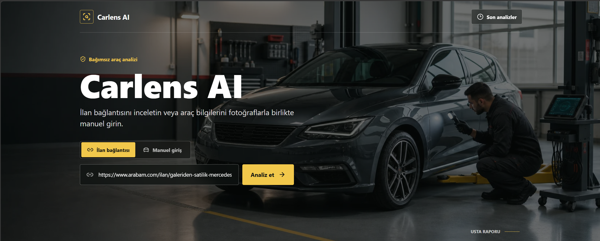
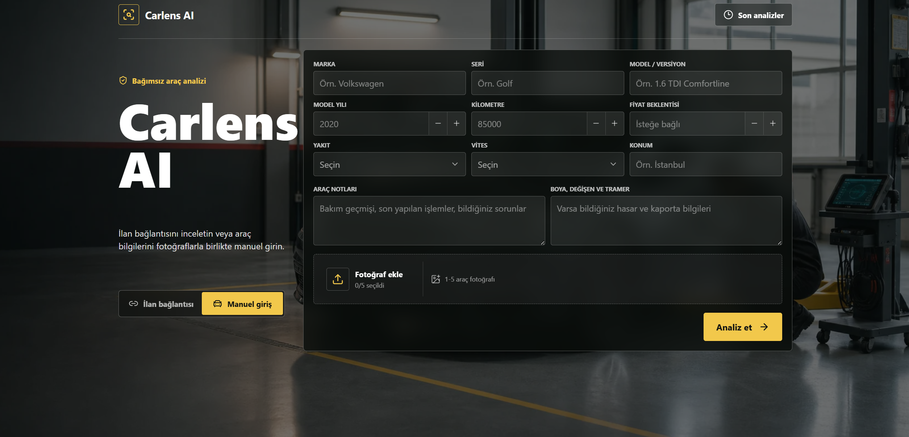
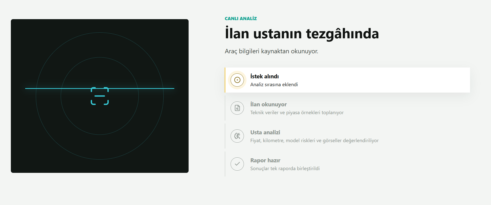
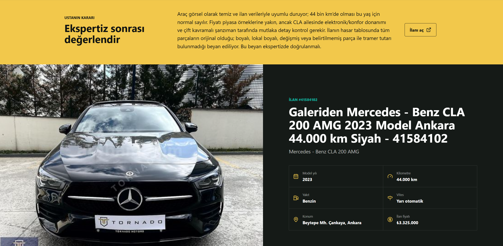
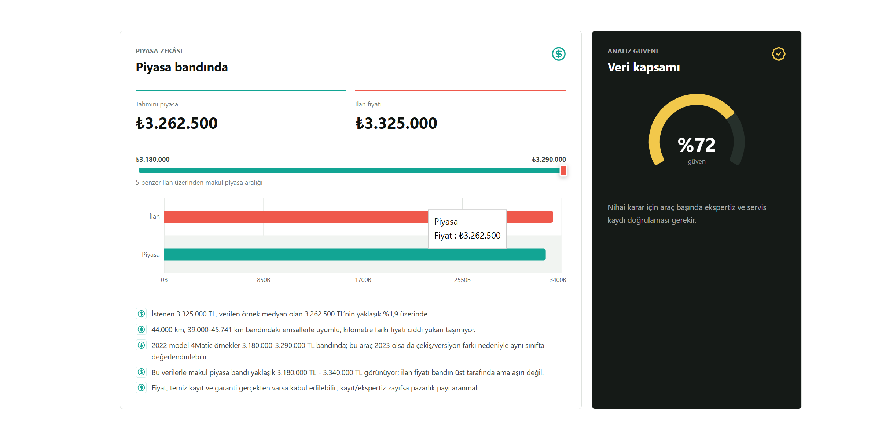
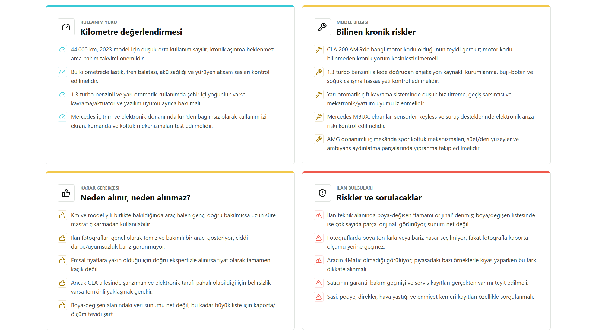
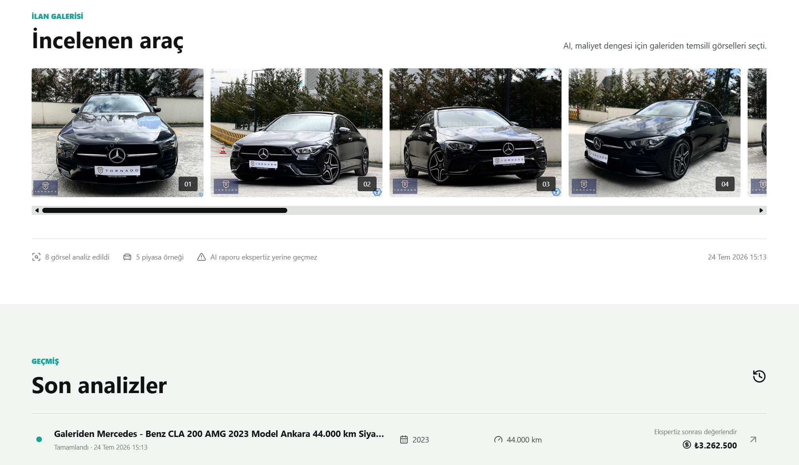
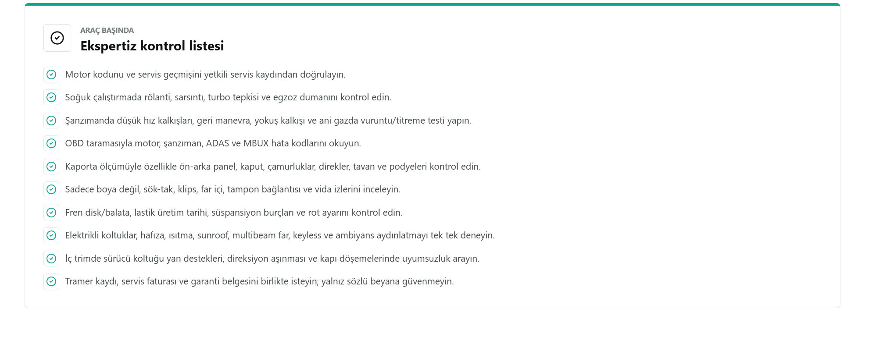
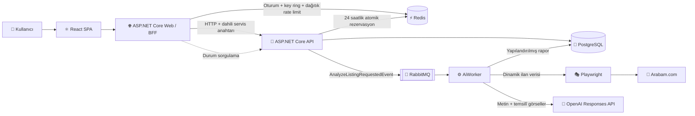

<div align="center">
  <h1>🚘 Carlens AI</h1>
  <h3>İkinci el araç ilanlarını ve araç fotoğraflarını usta gözüyle analiz eden yapay zekâ destekli karar platformu</h3>
  <p>
    Carlens AI; ilan verisini, piyasa emsallerini ve araç görsellerini tek bir raporda birleştirerek<br />
    <strong>fiyat, kilometre, kronik risk, ilan tutarlılığı ve satın alma kararı</strong> hakkında anlaşılır içgörüler üretir.
  </p>
  <p>
    
    
    
    
    
    
  </p>
</div>



## 📌 Proje Hakkında

İkinci el araç satın alırken ilandaki bilgileri okumak tek başına yeterli değildir. Fiyatın piyasaya göre konumu, kilometrenin araç yaşıyla uyumu, modelin bilinen problemleri, fotoğraflardaki olası ipuçları ve satıcının beyanları birlikte değerlendirilmelidir.

Carlens AI bu dağınık karar sürecini tek bir akışta toplar:

- 🔗 Desteklenen bir **Arabam.com ilan bağlantısını** okuyabilir.
- ✍️ İlan bağlantısı olmadan araç bilgileri **manuel olarak** girilebilir.
- 📷 Manuel analizde **1-5 araç fotoğrafı** yüklenebilir.
- 💰 Erişilebilen emsal ilanlardan **tahmini piyasa fiyatı ve fiyat aralığı** oluşturur.
- 🧭 Kilometreyi model yılı ve araç özellikleriyle birlikte değerlendirir.
- 🔧 Model ailesine ait bilinen kronik riskleri ve kontrol noktalarını açıklar.
- ✅ “Neden alınır, neden alınmaz?” sorusuna gerekçeli bir değerlendirme sunar.
- 🧾 Ekspertiz öncesinde kullanılabilecek kişiselleştirilmiş bir kontrol listesi üretir.
- 🖼️ Çok sayıdaki ilan fotoğrafından temsil gücü yüksek görselleri seçerek AI maliyetini sınırlar.

> [!IMPORTANT]
> Carlens AI bir ön değerlendirme ve karar destek uygulamasıdır. Üretilen rapor; fiziksel ekspertiz, servis kaydı, tramer sorgusu veya profesyonel mekanik kontrolün yerine geçmez.

## ✨ Kullanıcı Deneyimi

### İki farklı analiz yöntemi

Kullanıcı yalnızca ilan bağlantısı gönderebilir veya herhangi bir araca ait teknik bilgileri ve fotoğrafları manuel girebilir. Böylece sistem yalnızca aktif ilanlarla sınırlı kalmaz.



### Canlı analiz akışı

Uzun sürebilen ilan okuma ve AI işlemleri kullanıcı arayüzünü kilitlemez. İstek kuyruğa alınır; arayüz analiz durumunu takip ederek adımları canlı biçimde gösterir.



### Usta diliyle yapılandırılmış rapor

Sonuç tek parça ve okunması zor bir AI metni olarak sunulmaz. Araç özeti, karar, piyasa değerlendirmesi, kilometre yorumu, kronik riskler, ilan bulguları ve ekspertiz listesi ayrı bölümlerde gösterilir.



### Veriye dayalı piyasa değerlendirmesi

İlan fiyatı; benzer araçlardan hesaplanan tahmini piyasa değeri ve makul fiyat bandıyla karşılaştırılır. Kullanıcı, fiyat farkının hangi verilerden kaynaklandığını maddeler halinde görebilir.



### Teknik risk ve karar gerekçeleri

Kilometre yükü, modelin bilinen riskleri, alınabilirlik gerekçeleri ve ilanda doğrulanması gereken noktalar birbirinden ayrılır.



### Görsel galeri ve analiz geçmişi

AI tarafından değerlendirilen temsilî araç görselleri raporla birlikte sunulur. Aynı tarayıcı oturumunda oluşturulan son analizlere ana sayfadan erişilebilir.



### Ekspertiz kontrol listesi

Raporun sonunda, incelenen araca özel olarak serviste veya ekspertizde doğrulanması gereken noktalar listelenir.



## 🏗️ Mimari

Carlens AI, **Clean Architecture** sınırlarını koruyan ve bağımsız süreçlere ayrılmış dağıtık bir uygulamadır. API, Web/BFF ve Worker ayrı ayrı çalıştırılabilir ve container olarak dağıtılabilir.



Web ve API replikalarının durum sahipliği kararları [Stateless Çalışma Modeli](docs/architecture/statelessness.md) belgesinde açıklanır.

### Bir analiz isteği nasıl ilerler?

1. Kullanıcı ilan bağlantısını veya manuel araç bilgilerini React arayüzünden gönderir.
2. ASP.NET Core Web katmanı bir **BFF (Backend for Frontend)** gibi davranır; tarayıcı doğrudan backend API’ye erişmez.
3. API, FluentValidation kurallarıyla isteği doğrular.
4. URL tabanlı analizlerde Redis üzerindeki atomik `SET NX` işlemi, aynı ilanın 24 saat içinde tekrar kuyruğa alınmasını engeller.
5. Araç ve analiz kayıtları PostgreSQL’e yazılır.
6. `AnalyzeListingRequestedEvent`, RabbitMQ kuyruğuna gönderilir ve API kullanıcıya hemen `Pending` durumunu döner.
7. AiWorker mesajı tüketir; gerekiyorsa Playwright ile ilanı ve piyasa örneklerini okur, ardından seçilmiş görsellerle OpenAI Responses API’yi çağırır.
8. Yapılandırılmış sonuç veritabanına kaydedilir; React arayüzü durum sorgulayarak tamamlanan raporu aynı sayfada gösterir.

## 🧱 Clean Architecture ve CQRS

Bu projede bağımlılıklar dış katmanlardan iç katmanlara doğru ilerler. Domain katmanı veritabanını, RabbitMQ’yu, Redis’i, OpenAI’ı veya kullanıcı arayüzünü bilmez.

```text
Carlens.Domain
      ↑
Carlens.Application ← Carlens.Contracts
      ↑
Carlens.Infrastructure
      ↑
Carlens.Api / Carlens.AiWorker

Carlens.Web ──HTTP──> Carlens.Api
      └────────────> Carlens.Contracts
```

**CQRS yaklaşımı** kapsamında sistemi değiştiren işlemler `Command`, veri okuyan işlemler ise `Query` olarak ayrılmıştır. Her use case kendi handler sınıfında yürütülür. Bu yapı:

- Bir işlemin tüm iş akışını tek yerde görmeyi,
- Okuma ve yazma davranışlarını bağımsız geliştirmeyi,
- Handler’ları izole biçimde test etmeyi,
- Controller’ları ince ve yalnızca HTTP sorumluluğunda tutmayı sağlar.

Projede CQRS için gereksiz bir framework bağımlılığı eklenmemiş, handler’lar açık ve öğrenilebilir biçimde uygulanmıştır.

## 🧠 Teknolojiler ve Tercih Nedenleri

| Teknoloji / Yaklaşım | Projedeki rolü | Neden tercih edildi? |
|---|---|---|
| **.NET 10 / C#** | API, BFF, Worker ve uygulama katmanları | Yüksek performans, güçlü tip sistemi, yerleşik DI/hosting altyapısı ve uzun ömürlü backend geliştirme deneyimi |
| **ASP.NET Core Web API** | Analiz oluşturma, sorgulama ve görsel erişim uçları | Hafif middleware hattı, güçlü model binding, validation ve kolay container desteği |
| **Clean Architecture** | Domain, use case ve dış servis sınırları | İş kurallarını altyapı ayrıntılarından ayırmak, test edilebilirliği ve değiştirilebilirliği artırmak |
| **CQRS** | Command/Query ve handler tabanlı use case akışı | Okuma ile yazma niyetini görünür kılmak ve büyüyen iş akışlarını controller’lardan ayırmak |
| **React 19** | Tek sayfalı, responsive kullanıcı arayüzü | Analiz süreci, durum güncellemeleri, grafikler ve rapor bileşenleri için akıcı bir SPA deneyimi |
| **Vite 8 + pnpm** | Frontend geliştirme ve üretim derlemesi | Hızlı geliştirme sunucusu, optimize edilmiş bundle ve deterministik paket kurulumu |
| **ASP.NET Core BFF** | React ile API arasındaki güvenlik sınırı | Backend adresini ve servis anahtarını tarayıcıdan gizlemek; oturum, CSRF ve erişim denetimini sunucu tarafında yapmak |
| **PostgreSQL 18** | Araçlar, analizler, görseller, teknik özellikler ve emsaller | Güçlü ilişkisel model, transaction desteği, açık kaynak ekosistemi ve üretim olgunluğu |
| **EF Core 10** | ORM, entity konfigürasyonları ve migration yönetimi | Domain modellerini ilişkisel şemaya kontrollü biçimde eşlemek ve şema değişikliklerini versiyonlamak |
| **RabbitMQ 4** | Analiz istek kuyruğu | Uzun süren ilan okuma ve AI çağrılarını HTTP isteğinden ayırmak; manuel `ack/nack`, tek mesajlık prefetch ve graceful drain ile güvenilir tüketim |
| **Worker Service** | Kuyruktaki analizlerin arka planda işlenmesi | API’nin hızlı cevap vermesini, AI iş yükünün bağımsız ölçeklenmesini ve deployment sırasında devam eden mesajların güvenle tamamlanmasını sağlamak |
| **Redis 8** | Yinelenen analiz koruması, dağıtılmış session, Data Protection key ring ve dağıtık rate limit | Tekrar AI maliyetini önlemek; Web replikaları arasında oturum, güvenlik anahtarları ve istek kotalarını paylaşmak |
| **Microsoft Playwright** | JavaScript ile oluşturulan ilan verisini okumak | Dinamik sayfalarda gerçek tarayıcı davranışıyla güvenilir veri toplamak; headless çalışma ile kullanıcıya pencere göstermeden container sinyallerini doğrudan Worker'a iletmek |
| **OpenAI Responses API** | Metin ve görsellerden yapılandırılmış araç raporu üretmek | Çok modlu analiz, JSON Schema ile öngörülebilir çıktı ve maliyet/kullanım metriklerinin takip edilebilmesi |
| **Recharts** | Piyasa ve güven grafiklerinin çizimi | React ile uyumlu, responsive ve bileşen tabanlı veri görselleştirme |
| **Framer Motion** | Form ve durum geçişleri | Ani ekran değişimlerini azaltan, kullanıcıyı süreç boyunca yönlendiren akıcı animasyonlar |
| **Docker Compose** | API, Web, Worker, PostgreSQL, Redis ve RabbitMQ ortamı | Geliştirme ortamını tek komutla tekrarlanabilir biçimde kurmak ve servis bağımlılıklarını görünür kılmak |
| **Azure Container Apps + Bicep** | Staging ve production çalışma ortamı ile Infrastructure as Code | Revision tabanlı dağıtım, managed identity, private networking ve ortamlar arası tekrarlanabilir altyapı sağlamak |
| **Application Insights + OpenTelemetry** | API, Web ve Worker telemetrisi | Dağıtık istekleri, HTTP bağımlılıklarını, logları ve metrikleri aynı korelasyon bağlamında izlemek |
| **Trivy + CycloneDX** | Production container image taraması ve SBOM üretimi | Düzeltilmiş `HIGH`/`CRITICAL` açıkları merge öncesinde engellemek, image içeriğini makine tarafından okunabilir biçimde envanterlemek ve SARIF sonuçlarını GitHub Code Scanning’e taşımak |
| **xUnit + NetArchTest** | Unit testler ve Clean Architecture sınırları | Kritik davranışları hızlı doğrulamak ve yasak katman bağımlılıklarının zamanla geri gelmesini önlemek |
| **Testcontainers** | PostgreSQL, Redis ve RabbitMQ integration testleri | Mock yerine gerçek servisleri geçici Docker container’larında çalıştırarak production’a daha yakın ve tekrarlanabilir doğrulama yapmak |
| **GitHub Actions + CodeQL + Dependabot** | CI/CD kalite kapıları, güvenlik analizi ve bağımlılık takibi | Pull request’lerde build/test kontrollerini zorunlu kılmak; staging’i otomatik, production’ı onaylı blue-green akışla dağıtmak |

## 💸 AI Maliyet Optimizasyonu

İlanlarda 20-30 fotoğraf bulunabilmesi, kontrolsüz bir çok modlu AI çağrısının maliyetini hızla artırabilir. Carlens AI bu nedenle:

- Aynı görselin farklı çözünürlükteki URL’lerini tekilleştirir.
- Galerinin başından sonuna dengeli dağılan **en fazla 8 temsilî görseli** seçer.
- Görsel sayısı, detay seviyesi ve çıktı token limiti yapılandırmadan yönetilir.
- Kullanılan input/output token sayısını, analiz edilen görsel sayısını ve tahmini maliyeti analiz kaydında saklar.
- Redis ile aynı URL’nin 24 saat içinde yeniden işlenmesini engeller.
- Piyasa hesabını yalnızca modele değil; yıl, kilometre ve erişilebilen emsal verilerine dayandırmaya çalışır.

Bu yaklaşım, “bütün fotoğrafları modele gönder” yöntemine göre maliyeti sınırlarken galerinin farklı bölümlerinden görsel bağlamı korur.

## 🔐 Güvenlik Yaklaşımı

Bu repository herkese açık yayımlanabilecek şekilde tasarlanmıştır:

- OpenAI API anahtarı yalnızca `Carlens.AiWorker` tarafından okunur; React bundle’a, API cevabına veya kaynak koda eklenmez.
- Anahtarlar `.env` veya .NET User Secrets içinde tutulur; bu dosyalar Git tarafından izlenmez.
- Projeyi clone eden kişi **kendi OpenAI anahtarını sağlamak zorundadır**. Repository sahibinin kredilerine erişemez.
- Web BFF, backend API’ye ayrı bir dahili servis anahtarıyla erişir. Production ortamı, en az 32 karakterlik anahtar yoksa başlamaz.
- Servis anahtarı sabit zamanda karşılaştırılır; başarısız istekler `401 Unauthorized` alır.
- Analiz oluşturan isteklerde antiforgery token doğrulaması ve Redis üzerinde atomik, IP bazlı dağıtık rate limit bulunur.
- Analiz ve görsel erişimi `HttpOnly` ve `SameSite=Strict` oturumu üzerinden sınırlandırılır.
- Web session verisi ve ortam bazında izole edilen Data Protection key ring Redis üzerinde replikalar arasında paylaşılır.
- CSP, frame engelleme, MIME sniffing koruması, referrer ve permissions policy başlıkları uygulanır.
- URL istekleri ve fotoğraf yüklemeleri için ayrı request boyutu sınırları vardır.
- Docker geliştirme portları yalnızca `127.0.0.1` üzerinde yayımlanır.
- API, Web ve Worker production image’ları root yetkisi olmayan kullanıcılarla çalışır; Docker build context’i yalnızca gerekli `src` dosyalarını içeren allowlist yaklaşımıyla sınırlandırılır.
- Her production image’ı immutable `sha-<git-commit>` etiketiyle oluşturulur; Trivy düzeltilmiş `HIGH`/`CRITICAL` açıkları kalite kapısında engeller ve CycloneDX SBOM ile SARIF raporlarını workflow artifact’i olarak saklar.

> [!NOTE]
> Docker Compose ortamında Redis AOF kalıcılığı açıktır. Azure production profili PostgreSQL ve Azure Managed Redis'i public internete kapatır; private endpoint, TLS, managed identity ve Key Vault referansları kullanır.

## 📁 Solution Yapısı

```text
CarlensAI.sln
├── src
│   ├── Carlens.Domain          # Entity, enum, value object ve domain kuralları
│   ├── Carlens.Application     # Command, query, handler, validation ve arayüzler
│   ├── Carlens.Infrastructure  # EF Core, PostgreSQL, Redis, RabbitMQ, Playwright, OpenAI
│   ├── Carlens.Contracts       # API, Web ve Worker arasındaki request/response/event sözleşmeleri
│   ├── Carlens.Api             # Backend HTTP API ve dahili servis güvenliği
│   ├── Carlens.AiWorker        # RabbitMQ consumer ve analiz orkestrasyonu
│   └── Carlens.Web             # ASP.NET Core BFF + React SPA
├── test
│   ├── Carlens.Tests             # Domain, application, mapping ve güvenlik unit testleri
│   ├── Carlens.ArchitectureTests # Clean Architecture bağımlılık kuralları
│   └── Carlens.IntegrationTests  # PostgreSQL, Redis ve RabbitMQ Testcontainers testleri
├── docs
│   └── screenshots             # README ürün ekranları
├── infra                       # Bicep modülleri ve staging/production parametreleri
├── .github
│   ├── workflows              # CI, güvenlik, Bicep doğrulama, staging/production CD ve CodeQL
│   └── dependabot.yml
└── docker-compose.yml
```

Azure kaynakları foundation ve application deployment olarak ikiye ayrılır.
PostgreSQL 18, Azure Managed Redis, ACR, Key Vault, Application Insights,
Log Analytics, VNet ve Container Apps ortamının ayrıntıları için
[`infra/README.md`](infra/README.md) dosyasına bakabilirsiniz.

## 🧩 Servisler

| Servis | Görev | Yerel Docker adresi |
|---|---|---|
| `carlens-web` | React SPA’yı sunar ve BFF görevi görür | `http://localhost:5001` |
| `carlens-api` | Use case’leri HTTP üzerinden sunar | `http://localhost:5000` |
| `carlens-aiworker` | Kuyruktaki AI analizlerini işler | Arka plan servisi |
| `postgres` | Kalıcı ilişkisel veri deposu | `localhost:5432` |
| `redis` | Yinelenen analiz rezervasyonu | `localhost:6380` |
| `rabbitmq` | Analiz event kuyruğu | `localhost:5673` |
| `rabbitmq` yönetim paneli | Kuyruk ve consumer gözlemi | `http://localhost:15673` |

## 🚀 Kurulum ve Çalıştırma

### Gereksinimler

- [.NET 10 SDK](https://dotnet.microsoft.com/download/dotnet/10.0)
- [Docker Desktop](https://www.docker.com/products/docker-desktop/)
- Repository tarafından sabitlenen EF Core CLI: `dotnet tool restore`
- Yalnızca frontend’i yerelde geliştirmek için Node.js 24 ve pnpm 11
- Size ait bir OpenAI API anahtarı

### 1. Repository’yi hazırlayın

```powershell
git clone <repository-url>
cd CarlensAI
dotnet restore CarlensAI.sln
```

### 2. Sırları yalnızca mevcut terminal oturumuna ekleyin

```powershell
$env:OPENAI_API_KEY = "<size-ait-openai-api-key>"

$keyBytes = New-Object byte[] 48
$rng = [Security.Cryptography.RandomNumberGenerator]::Create()
$rng.GetBytes($keyBytes)
$rng.Dispose()
$env:CARLENS_INTERNAL_API_KEY = [Convert]::ToBase64String($keyBytes)
```

Anahtarları kalıcı yerel Docker ayarı olarak tutmak isterseniz `.env.example` dosyasını `.env` olarak kopyalayabilirsiniz. `.env`, `.gitignore` kapsamındadır ve commit edilmez.

```powershell
Copy-Item .env.example .env
```

### 3. Altyapı servislerini başlatın ve migration uygulayın

```powershell
docker compose up -d postgres redis rabbitmq

dotnet ef database update `
  --project src/Carlens.Infrastructure/Carlens.Infrastructure.csproj `
  --startup-project src/Carlens.Api/Carlens.Api.csproj `
  --connection "Host=localhost;Port=5432;Database=carlensai;Username=carlens;Password=carlens"
```

### 4. Tüm uygulamayı çalıştırın

```powershell
docker compose up --build
```

Uygulamayı `http://localhost:5001` adresinden açabilirsiniz.

### Yerel geliştirme için User Secrets

Docker yerine API, Worker ve Web projelerini doğrudan çalıştırırken hassas değerleri repository dışındaki .NET User Secrets deposunda tutun:

```powershell
dotnet user-secrets set "OpenAI:ApiKey" "<size-ait-openai-api-key>" `
  --project src/Carlens.AiWorker/Carlens.AiWorker.csproj

dotnet user-secrets set "ConnectionStrings:Postgres" `
  "Host=localhost;Port=5432;Database=carlensai;Username=carlens;Password=carlens" `
  --project src/Carlens.Api/Carlens.Api.csproj

dotnet user-secrets set "ConnectionStrings:Postgres" `
  "Host=localhost;Port=5432;Database=carlensai;Username=carlens;Password=carlens" `
  --project src/Carlens.AiWorker/Carlens.AiWorker.csproj

dotnet user-secrets set "Security:InternalApiKey" $env:CARLENS_INTERNAL_API_KEY `
  --project src/Carlens.Api/Carlens.Api.csproj

dotnet user-secrets set "Security:InternalApiKey" $env:CARLENS_INTERNAL_API_KEY `
  --project src/Carlens.Web/Carlens.Web.csproj
```

React üretim çıktısını hazırlayın:

```powershell
corepack enable
Push-Location src/Carlens.Web/ClientApp
pnpm install --frozen-lockfile
pnpm build
Pop-Location
```

Ardından üç ayrı terminalde çalıştırın:

```powershell
dotnet run --project src/Carlens.Api/Carlens.Api.csproj
dotnet run --project src/Carlens.AiWorker/Carlens.AiWorker.csproj
dotnet run --project src/Carlens.Web/Carlens.Web.csproj
```

## 🧪 Test ve Kod Kalitesi

Hızlı unit ve architecture testlerini çalıştırmak için:

```powershell
dotnet test test/Carlens.Tests/Carlens.Tests.csproj
dotnet test test/Carlens.ArchitectureTests/Carlens.ArchitectureTests.csproj
```

Docker Desktop çalışırken gerçek PostgreSQL, Redis ve RabbitMQ servisleriyle integration testlerini çalıştırmak için:

```powershell
dotnet test test/Carlens.IntegrationTests/Carlens.IntegrationTests.csproj
```

Entity modeli değiştiği halde migration eklenmesinin unutulmadığını doğrulamak için:

```powershell
dotnet tool restore
dotnet ef migrations has-pending-model-changes `
  --project src/Carlens.Infrastructure/Carlens.Infrastructure.csproj `
  --startup-project src/Carlens.Api/Carlens.Api.csproj `
  -- --environment Development
```

Frontend üretim derlemesini doğrulamak için:

```powershell
Push-Location src/Carlens.Web/ClientApp
pnpm install --frozen-lockfile
pnpm build
Pop-Location
```

GitHub Actions, `main` hedefli her pull request’te ve `main` branch’ine yapılan her push’ta uyarıları hata kabul eden .NET build, unit test, architecture test, Testcontainers integration testleri, migration drift kontrolü ve React production build adımlarını çalıştırır. Test sonuçları workflow artifact’i olarak saklanır.

Ayrı container güvenliği workflow’u API, Web ve Worker production image’larını immutable Git SHA etiketleriyle oluşturur, runtime kullanıcısının root olmadığını doğrular ve Trivy ile düzeltilmiş `HIGH`/`CRITICAL` açıkları merge öncesinde engeller. Her image için CycloneDX SBOM ve SARIF raporu üretilir; raporlar workflow artifact’i olarak saklanır ve `main` push’larında GitHub Code Scanning’e yüklenir. CodeQL, C# ve JavaScript/TypeScript kaynaklarını tarar; Dependabot ise NuGet, npm, Docker ve GitHub Actions bağımlılıklarını haftalık olarak takip eder.

Infrastructure workflow’u checksum ile doğrulanmış sabit Bicep CLI ve Actionlint sürümlerini kullanır; ShellCheck ile deployment scriptlerini, Actionlint ile workflow’ları, ayrıca foundation, application, migration job ve altı ortam parametre dosyasını doğrular. Secure PostgreSQL parametresi, immutable image etiketi, blue-green trafik sözleşmesi, koşullu Worker rollout’u, manuel ve tek replica EF migration job’u ile secret içermeyen output sözleşmesi ARM şablonları üzerinde kalite kapısı olarak sınanır.

Staging CD, protected `main` branch’indeki zorunlu kalite kontrollerini bekledikten sonra OIDC ile Azure’a bağlanır. API, Web ve Worker image’larını yeniden tarayıp immutable Git SHA etiketiyle ACR’a gönderir ve kilitler; EF Core migration job’unu çalıştırdıktan sonra Container Apps revision’larını dağıtır. Live/readiness kontrollerinin yanında SPA, HSTS ve Web üzerinden API gateway smoke testi de deployment kalite kapısıdır. Azure erişimi client secret içermez ve pipeline yalnızca `AZURE_DEPLOYMENTS_ENABLED=true` olduğunda etkinleşir.

Production CD yalnızca GitHub `production` Environment onayından sonra manuel olarak başlatılır. Başarılı staging deployment’ına ait kilitli image digest’lerini yeniden build etmeden production ACR’a taşır, geriye uyumlu migration job’unu çalıştırır ve yeni API/Web revision’larını önce `%0` trafikle doğrular. Trafik `%5 → %25 → %50 → %100` şeklinde readiness ve smoke test kapılarıyla ilerler; herhangi bir kapı başarısız olursa önceki revision’lara otomatik rollback uygulanır. RabbitMQ mesajlarının iki Worker sürümü tarafından eşzamanlı tüketilmemesi için Worker yalnızca HTTP trafiği tamamen aktarıldıktan sonra Single revision modunda güncellenir.

## 🎯 Bu Projede Sergilenen Yetkinlikler

- SOLID prensipleriyle domain modelleme ve katman bağımlılıklarının yönetimi
- Clean Architecture ile framework’ten bağımsız iş kuralları
- CQRS tabanlı use case tasarımı ve FluentValidation
- RabbitMQ ile event-driven iş akışı, manuel acknowledgement ve Worker graceful shutdown
- Redis ile atomik idempotency, dağıtılmış session, paylaşılan Data Protection key ring ve dağıtık rate limit yönetimi
- PostgreSQL, EF Core configuration ve migration yönetimi
- NetArchTest ile otomatik Clean Architecture sınırları
- Testcontainers ile gerçek PostgreSQL, Redis ve RabbitMQ integration testleri
- GitHub Actions üzerinde build, test ve migration drift kalite kapıları
- Rootless container image’ları, Trivy vulnerability gate, CycloneDX SBOM ve SARIF raporlama
- Bicep ile modüler Azure IaC, private endpoint, managed identity ve least-privilege RBAC
- GitHub OIDC, immutable ACR artifact’leri, migration job ve smoke testlerle otomatik staging CD
- GitHub Environment onayı, kademeli trafik aktarımı ve otomatik rollback ile production blue-green CD
- Application Insights ve OpenTelemetry ile merkezi trace, metric ve log korelasyonu
- OpenAI ile çok modlu ve JSON Schema tabanlı yapılandırılmış çıktı
- Playwright ile dinamik web verisi okuma
- AI token/görsel maliyeti optimizasyonu ve kullanım metriği takibi
- React ile responsive, animasyonlu ve grafik destekli ürün arayüzü
- BFF, CSRF, rate limit, oturum izolasyonu ve güvenlik başlıkları
- Docker Compose, CI, CodeQL ve bağımlılık otomasyonu

## 🗺️ Planlanan Geliştirmeler

- Kullanıcı hesabı, rol ve yetkilendirme
- Kullanıcı bazlı kredi/kota ve abonelik yönetimi
- Resmî erişim sağlanan ek ilan kaynakları
- Kaydedilebilir ve paylaşılabilir analiz raporları
- Kimlik doğrulama sonrası kullanıcı ve abonelik bazlı kota politikaları
- Retry politikası, dead-letter queue ve gelişmiş mesaj gözlemlenebilirliği

## ⚖️ Yasal ve Teknik Uyarı

Carlens AI tarafından üretilen fiyat ve teknik değerlendirmeler; ilandaki bilgiler, erişilebilen piyasa örnekleri, yüklenen görseller ve AI çıkarımlarına dayanır. Son satın alma kararı öncesinde aracı bağımsız ekspertize göstermek ve resmî kayıtları doğrulamak kullanıcının sorumluluğundadır.

---

<div align="center">
  <strong>Carlens AI</strong><br />
  Yapay zekâ, dağıtık sistemler ve modern web teknolojilerini gerçek bir ürün senaryosunda bir araya getiren portföy projesi.
</div>
